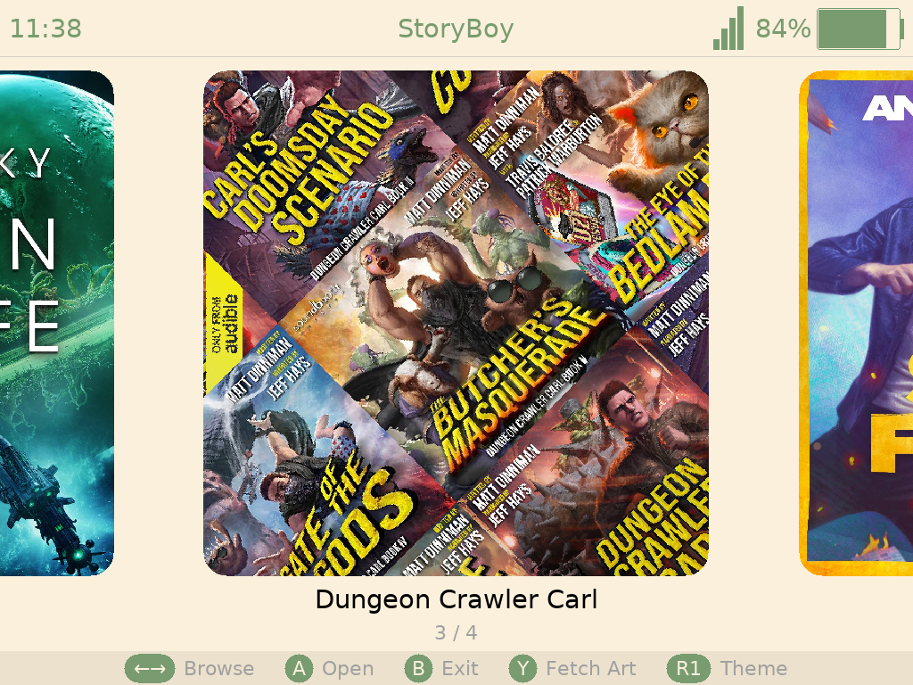

  
  <h1>GVU</h1>
  
Audiobook player for SpruceOS handheld devices

---

StoryBoy is a native audiobook player for SpruceOS devices. It has a three-level media browser (series → audiobooks → files),embedded cover art or online cover art fetching, listen history with resume, a clean fullscreen playback UI with OSD, variable playback speed, and sleep timer. It's written in C around FFmpeg and SDL2.

---

## Supported Devices

| Device | Notes |
|---|---|
| Miyoo A30 | 640×480, ARMv7. Works great. |
| TrimUI Brick / Hammer | 1024×768, AArch64. Works great. |
| TrimUI Smart Pro / Pro S | 1280x720, AArch64. Works great (I think). |
| Miyoo Flip V1/V2 | 640×480, AArch64. Works great. |
| Miyoo Mini Flip (V4) | 752×560, ARMv7. Audio via SigmaStar bridge. |
| Miyoo Mini V2/V3 | 640×480, ARMv7. Video works; audio broken, currently. |

---

## Installation

1. Download the latest release zip from the [Releases](../../releases) page.
2. Extract the zip to your SD card — make sure you have a `/mnt/SDCARD/App/StoryBoy/`.
3. Launch from the SpruceOS app menu.

On first launch, StoryBoy scans your media folders and builds its library. Make sure your audibook files are in `/mnt/SDCARD/Media/Audiobooks/`.  StoryBoy uses folders to define audiobooks, so each book will need its own folder, but they can be nested by series.  This was a compromise in order to support audiobooks are split up between multiple .mp3 files.   

EXAMPLE: 
> /mnt/SDCARD/Media/Audiobooks/Dungeon Crawler Carl/Carl's Doomsday Scenario/Carl's Doomsday Scenario (Book 2).m4b

EXAMPLE:
> /mnt/SDCARD/Media/Audiobooks/Dungeon Crawler Carl/
>>>     . The Dungeon Anarchist's Cookbook/
>>>     ..  DCC.The_Dungeon_Anarchist's_Cookbook_chapter1.mp3
>>>     ..  DCC.The_Dungeon_Anarchist's_Cookbook_chapter2.mp3
>>>     ..  DCC.The_Dungeon_Anarchist's_Cookbook_chapter3.mp3
>>>     ..  ...

Audiobooks that aren't part of a series, or you don't want them to be nested as a series, can be put in the Audiobooks folder:
 
> EXAMPLE: /mnt/SDCARD/Media/Audiobooks/Animal Farm/Animal Farm - George Orwell.m4b

> EXAMPLE: /mnt/SDCARD/Media/Audiobooks/Change Agent/Change.Agent_ch01.mp3, Change.Agent_ch02.mp3, Change.Agent_ch03.mp3, ...

---

## Features

- **File browser** — three-level hierarchy (series → book → files) with folder grid and cover art
- **Cover art** — automatic use of embedded art, or by downloading from Open Library (press Y on any show)
- **Automatic Mosaic** — For series, a mosaic is made by tiling the 
- **Playback** — Chapter indicators, playback speed (1x, 1.25x, 1.5x, 2x)
- **Sleep Timer** — Sleep timer (10m, 20m, 1h, 2h)
- **Screensaver** — Black screen and button lock
- **Seek** — ±10s / ±60s / or by chapter
- **Listen history** — remembers where you left off across all shows
- **Themes** — ten color themes, cycle with R1 in the browser
- **OSD** — progress bar, current time, title, volume
- **Status bar** — clock, title, WiFi signal, battery level

---

## Basic Usage

### Navigation

- **D-pad** — navigate the file browser
- **A** — open folder / play audiobook
- **B** — back
- **Hold D-pad up/down** — fast scroll through long lists

### Playback controls

| Button | Action |
|---|---|
| D-pad left/right | Seek ±10 seconds |
| D-pad up/down | Brightness ± |
| L1 | Seek -60 seconds |
| R1 | Seek +60 seconds |
| L2 | Previous chapter in current book |
| R2 | Next chapter in current book |
| A | Play / Pause |
| B | Back to browser |
| X | Cycle sleep timer  |
| Y | Double-press for screensaver & button lock |
| START | Toggle playback speed |
| SELECT | Reset playback speed to 1x |
| Volume up/down | Adjust volume |

### Browser controls

| Button | Action |
|---|---|
| D-pad | Navigate |
| A | Open folder / play audiobook |
| B | Back (press twice at top level to exit) |
| X | Open listening history |
| Y | Manage cover art for selected audiobook |
| SELECT | Cycle view layout |
| R1 | Cycle color theme |

### Cover art

Press **Y** on any audiobook in the browser folder grid to scrape cover art from Open Library. 

You can also add covers manually by placing a `cover.jpg` or `cover.png` in the folder with your audibook .m4b or .mp3 files.

---

## Supported Formats

Audio: M4B, MP3

All decoding is software.

---

Enjoy! :)
